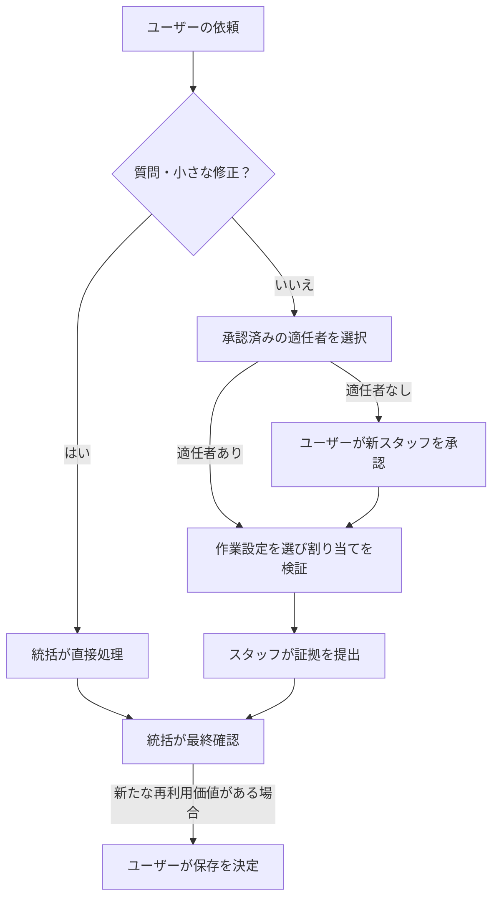

<h1 align="center">Open Jarvis</h1>

<p align="center">専門スタッフとの協働。あなたの設定。再利用できる成果。</p>

<p align="center">
  <a href="README.md">English</a> · <a href="README.zh-CN.md">简体中文</a> · <a href="README.ja.md">日本語</a>
</p>

<p align="center">
  <a href="LICENSE"></a>
  <a href="docs/compatibility.md"></a>
  <a href="https://github.com/lbtlm/open-jarvis/actions/workflows/release.yml"></a>
  <a href="https://github.com/lbtlm/open-jarvis/releases"></a>
</p>

Open Jarvis は **Codex Desktop と CLI** に統括エージェントが監督する協働の手順を提供します。開発、執筆、事務、動画の作業で、受け入れ条件を定め、適任のスタッフを選び、実行を確認し、承認を得て成果を再利用できます。

[クイックスタート](#quick-start) · [主な機能](#capabilities) · [作業の流れ](#workflow) · [スタッフと設定](#employees-and-settings) · [コマンド](#commands) · [再利用資産](#assets) · [FAQ](#faq) · [検証状況](#verification) · [貢献](#contributing)

<a id="quick-start"></a>

## クイックスタート

**Node.js 22+**（npm/npx を含む）と、独立したサブエージェントのロール設定に対応するログイン済みの Codex が必要です。Desktop と CLI が同じ Codex home を使う場合、インストールは 1 回で十分です。

[GitHub Releases](https://github.com/lbtlm/open-jarvis/releases) から公開済みのバージョンを選んでください。以下は **0.1.2** の例です。別のバージョンでは、番号、URL、ファイル名を合わせて変更します。該当する成果物が利用できない場合は、下記の確認済みローカルパッケージを使ってください。

```sh
npx --package=https://github.com/lbtlm/open-jarvis/releases/download/v0.1.2/open-jarvis-0.1.2.tgz open-jarvis install
```

**ターミナルのウィザードで設定を選びます：** 統括と実行ロールのモデル、推論の強度、Fast、スタッフのテンプレート。既定のテンプレートは `none` なので、協働ルールから始めて必要なスタッフを追加できます。既存の設定を優先し、新規導入の統括には Astra / High を推奨します。Fast は別に選び、既定ではオフです。Ultra の自動有効化や Sol への自動切り替えは行いません。

<details>
<summary>pnpm の代替手順と確認済みローカルパッケージ</summary>

```sh
pnpm --package=https://github.com/lbtlm/open-jarvis/releases/download/v0.1.2/open-jarvis-0.1.2.tgz dlx open-jarvis install
```

確認済みのパッケージを現在のディレクトリに置き、どちらかの実行方法を使います。

```sh
npx --package ./open-jarvis-0.1.2.tgz open-jarvis install
pnpm --package=./open-jarvis-0.1.2.tgz dlx open-jarvis install
```

両方とも同じ Codex home、スタッフ、資産を使います。パッケージは GitHub Releases で配布し、**npm registry には公開していません**。依存関係は npm から取得する場合があり、完全なオフライン導入は保証しません。導入先は `--home`、`CODEX_HOME`、`~/.codex` の順で決まります。`--yes` は対話なしで導入し、既存の設定を維持します。pnpm **10.18.1** は Windows 上でローカル検証済みです。[互換性（英語）](docs/compatibility.md)を参照してください。

</details>

導入後、新しい Codex タスクで、例えば次のように依頼します。

> Jarvis の手順でこの作業を進めてください。統括が受け入れ条件を定め、能力に合うスタッフを選び、実行を監督して最終確認してください。実際のエージェント ID と実行時設定の証拠も記録してください。

導入前は `audit` で変更を確認し、導入後は `doctor` で静的に検査できます。新しいセッションは設定の読み込みに役立ちますが、ロールと実行時設定は実際の割り当てでも確認が必要です。

<a id="capabilities"></a>

## 主な機能

- **さまざまな分野で協働。** 開発、執筆、事務、動画の成果物、言語、手法、ツールに合う専門スタッフを選びます。
- **割り当てを検証可能に。** 範囲、受け入れ条件、要求設定、実際のエージェント ID、実行時の証拠を明示します。
- **作業に合わせてスキルを選択。** 専門職をモデルやスキル一覧に恒久的に固定せず、適切な手法を使います。
- **承認を得て成果を再利用。** 検証した経験、スキル、知識、好み、テンプレートを保存し、移行は適用前に確認します。

<a id="workflow"></a>

## 作業の流れ



### 四つの選択を分ける

- **スタッフ：** 能力、範囲、証拠を記した再利用可能な専門職カード。常駐サービスやネイティブロールの登録ではありません。
- **スキル：** 今回の作業手法。ユーザーの指定を優先し、次に適した導入済みスキルを探します。不足する場合は外部検索を行えますが、導入には別途承認が必要です。
- **実行設定：** 作業ごとに選ぶモデル、推論の強度、Fast。実行時の確認が必要で、スタッフの身分に恒久的には固定しません。
- **保存資産：** 検証し、ユーザーの承認で保存した成果。作業の承認は恒久保存の承認ではなく、バックグラウンドでの自動学習は行いません。

<a id="employees-and-settings"></a>

## スタッフと実行設定

通常の質問、単一手順の調査、すぐに確認できる小さな修正は、統括が直接処理します。
それ以外は、必要な分野、成果物、言語、手法とツールを先に確認し、能力が一致する承認済みスタッフから再利用を優先します。
承認済みであること、空いていること、固定モデルを持つことだけでは、専門能力の根拠になりません。
適任者がいなければ、統括が責務・スキル・設定を示して臨時スタッフを提案し、ユーザーの承認後に割り当てます。
無関係なスタッフに無理に任せたり、名前を変えて専門性があるように扱ったりしません。

| 実行プロファイル | 推奨モデル / 推論の強度 | 適した作業 |
| --- | --- | --- |
| `controller`（統括） | GPT-6 Astra / High | 調整、監督、最終確認 |
| `luna` | GPT-6 Luna / Medium | 明確でリスクの低い小作業 |
| `simple` | GPT-6.1 Sol / Low | 仕組みが既知の簡単な実装 |
| `terra` | GPT-6.1 Sol / Medium | 通常作業と範囲内での未知の不具合調査 |
| `sol` | GPT-6.1 Sol / High | 契約の変更、複雑な意味論、重要な挙動 |
| `reviewer` | GPT-6.1 Sol / High | リスクや証拠に基づく独立レビュー |

これらは推奨値で、既存のユーザー設定が優先されます。`terra` は互換用キーであり、GPT-6 Terra という製品を指しません。
Fast はモデルや推論の強度とは別に選びます。モデルの利用可否、権限、サービス設定は実行時の確認が必要です。
既定の実行担当は 1 人です。同時実行のサブエージェントは Reviewer を含め、統括を除いて最大 3 人で、より低いユーザー指定や全体上限に従います。
実行担当は再帰的に委派しません。独立レビューは明示されたリスクや証拠に応じて行い、全タスクで必須ではありません。
必要なモデル、Fast、Reviewer の読み取り専用権限を維持できない場合、その割り当てが実行できないことを報告します。

<details>
<summary>スタッフのテンプレートとスキル計画</summary>

| テンプレート | 候補スタッフ |
| --- | --- |
| `none` | スタッフカードを追加しない |
| `development` | Iris（フロントエンド）、Atlas（バックエンド）、Quinn（QA）、Sentry（レビュー） |
| `writing` | Nova（執筆） |
| `office` | Clara（事務） |
| `video` | Frame（動画） |

テンプレートは候補カードです。採用済み、スキル読み込み済み、経験が検証済みという意味ではありません。
従来の `employees --init --yes` も利用でき、既定では不足している開発テンプレートのカードを追加します。
例えば、執筆の候補カードを確認してから明示的に書き込みます。

```sh
npx --package ./open-jarvis-0.1.2.tgz open-jarvis employees --init --starter writing
npx --package ./open-jarvis-0.1.2.tgz open-jarvis employees --init --starter writing --yes
npx --package ./open-jarvis-0.1.2.tgz open-jarvis plan --employee nova-writer --difficulty standard --skill my-writing-skill
```

`my-writing-skill` は例示用のスキル ID です。実在するスキルに置き換えてください。不足している場合、計画は実行不可として報告されます。
`plan` はスタッフを起動せず、スキル本文を読まず、スキルが読み込まれたことも証明しません。
スキルはユーザーの明示指定を優先し、次に適合する導入済みスキルを探し、なお不足する場合に外部検索を行います。
カード内の提案は許可リストではありません。`--skill` でカード外のスキルを一時指定しても、カードは恒久変更されません。
Jarvis の導入は全スキルの一括導入ではなく、Office、編集、プラグイン、クラウドアカウントの利用能力も付与しません。
スタッフカードはファイル資産で、常駐プロセスではありません。[スタッフの運用規約（英語）](payload/skills/jarvis-orchestrator/references/employees.md)を参照してください。

</details>

<a id="commands"></a>

## よく使うコマンド

以下は**コマンドの末尾部分**で、単独では実行できません。次の完全な実行プレフィックスに追加してください。

```sh
npx --package=https://github.com/lbtlm/open-jarvis/releases/download/v0.1.2/open-jarvis-0.1.2.tgz open-jarvis
```

どの末尾部分も、`pnpm --package=https://github.com/lbtlm/open-jarvis/releases/download/v0.1.2/open-jarvis-0.1.2.tgz dlx open-jarvis` に追加できます。確認済みローカルパッケージでは、`npx --package ./open-jarvis-0.1.2.tgz open-jarvis` または `pnpm --package=./open-jarvis-0.1.2.tgz dlx open-jarvis` を使い、末尾部分はそのままにします。

| コマンドの末尾部分 | 用途 |
| --- | --- |
| `audit` | 書き込まずにインストール変更を確認 |
| `install --starter none` | バックアップを保護して導入・更新 |
| `doctor` | 導入済みファイルを静的に検査 |
| `rollback --manifest /path/to/manifest.json` | マニフェストを使って 1 回分の導入を戻す |
| `employees --query writing` | スタッフカードを検索、またはテンプレート追加を確認 |
| `plan --employee nova-writer --difficulty standard` | スタッフ、スキル、実行プロファイルを確認 |
| `export --out ./my-assets.jarvis.json.gz` | 新しい資産アーカイブを作成 |
| `import --from ./my-assets.jarvis.json.gz` | 適用前に資産アーカイブを確認 |

例えば、静的な検査は次のように実行します。

```sh
npx --package=https://github.com/lbtlm/open-jarvis/releases/download/v0.1.2/open-jarvis-0.1.2.tgz open-jarvis doctor
```

`/path/to/manifest.json` は例示用のパスです。実際のインストールマニフェストに置き換えてください。
`--home PATH` は Codex home、`--project PATH` はプロジェクト資産を明示的に選び、`--json` は機械可読の結果を出力します。
全オプションは `npx --package ./open-jarvis-0.1.2.tgz open-jarvis --help` で確認できます。
`audit` と `doctor` はモデルへのリクエストを行わず、スタッフが実行されたことも証明しません。

<a id="assets"></a>

## 再利用できる資産

再利用できる成果は「候補を作る → 検証する → ユーザーが決める → 保存・更新する → 次回再利用する」という手順で蓄積します。
スタッフの経験、スキル、知識、好み、テンプレートを保存できます。経験には実際の証拠と適用条件が必要です。
タスクや臨時採用の承認は、恒久保存の承認ではありません。モデル学習や長期指示の自動書き換えも行いません。
毎回の採点、振り返り、統計は必須ではありません。[資産の改善手順（中国語）](docs/asset-evolution.md)を参照してください。

<details>
<summary>移行コマンド・パス・上限</summary>

個人資産は Codex home の `jarvis/`、プロジェクト資産は `.jarvis/` に保存します。
エクスポートにはスタッフ、知識、好み、resources、選択したスキルのディレクトリ、モデル設定を含みます。
`jarvis/skills.json` で補助スキルの依存関係を明示登録します。全スキルやプラグインの走査、本文からの全依存関係の推測は行いません。
既定のスキル探索先は、プロジェクトの `.agents/skills`、`.codex/skills`、home の `skills`、home と同階層の `.agents/skills` の順です。
`--skill-root PATH` を複数指定すると、既定のエクスポート探索先の一覧を完全に置き換えます。

```sh
npx --package ./open-jarvis-0.1.2.tgz open-jarvis export --out ./my-assets.jarvis.json.gz
npx --package ./open-jarvis-0.1.2.tgz open-jarvis import --from ./my-assets.jarvis.json.gz
npx --package ./open-jarvis-0.1.2.tgz open-jarvis import --from ./my-assets.jarvis.json.gz --yes
npx --package ./open-jarvis-0.1.2.tgz open-jarvis install --models /path/to/codex-home/jarvis/models.json --yes
```

プロジェクト資産は、移行元のエクスポートと移行先のインポートの両方で `--project` を明示し、それぞれのプロジェクトパスを指定します。
インポートはまずプレビューし、`--yes` で書き込みます。同一内容はスキップし、内容差分が 1 件でもあれば全体を停止します。上書きやスクリプト実行は行いません。
最後のコマンドのパスは置き換えてください。モデル設定を確認してから明示的にインストールで有効化します。インポートだけでは統括は変わりません。
移行先のログイン、プラグイン、外部ツール、権限は別途復元してください。資産内の絶対パスは自動変更されません。
アーカイブの上限は、1 ファイル **4 MiB**、内容合計 **32 MiB**、圧縮後 **16 MiB**、最大 **5000** ファイルです。
動画などの大きなメディアは別途移行します。本文の自動匿名化は行わないため、共有前に確認してください。hash は完全性の検査で、出所を証明する署名ではありません。
詳しくは[資産の運用手順（英語）](payload/skills/jarvis-orchestrator/references/assets.md)を参照してください。

</details>

<a id="faq"></a>

## よくある質問

**統括は変更されますか？** 既存のモデル、推論の強度、Fast 設定は維持されます。新規導入では Astra / High を推奨します。
`--models` を明示的に使う前にファイルを確認してください。専門職や実行プロファイルがユーザーの統括を自動的に置き換えることはありません。

**有効になったことをどう確認しますか？** `audit` / `doctor` の後、新しいタスクを開いて実際にスタッフを割り当てます。
実際のエージェント ID と実行時設定を記録してください。設定ファイルや新しいセッションだけでは、ネイティブ登録、即時再読み込み、権限の有効化は保証されません。

**適任のスタッフがいない場合は？** 分野、言語、成果物、ツールに合う臨時の専門職を提案し、承認後に実行します。
テンプレートや肩書きは能力の証拠ではありません。無関係なバックエンド担当を言語専門家に改名して済ませることはしません。

**更新とロールバックの手順は？** `audit` の後に `install` を実行し、戻す場合はその導入のマニフェストを `rollback --manifest` に指定します。
導入とロールバックは自身の設定を管理し、ユーザーのスタッフや資産を削除しません。後続の変更と競合するとロールバックを拒否します。機密を含み得るバックアップは公開しないでください。

<a id="verification"></a>

## 検証状況と現在の制限

[CI 実行 36688019909](https://github.com/lbtlm/open-jarvis/actions/runs/36688019909) は Windows/macOS/Linux × Node 22/24 の全ジョブ、両パッケージ実行方法、CI Gate に合格しました。最終テストは **91 件**で、Windows は **90 件成功 / POSIX 専用 1 件スキップ**、macOS と Linux は **91 件成功**です。

**リリースコードの限定的なレビュー**は合格しました。以前の `assets.mjs` の独立レビューは未完了であり、全面的なセキュリティ監査ではありません。リンク先の CI は、実際の 2 バージョン間のアップグレードや公開 Release からの導入を検証していません。公開と公開 URL からの導入結果は [Release ワークフロー](https://github.com/lbtlm/open-jarvis/actions/workflows/release.yml)で確認してください。静的検査はモデルの実動作を証明しません。

3 言語の完全版 README は同じ機能を説明します。CLI と詳しい参考文書の大半は未翻訳で、リンク先の言語を明記しています。[検証記録（英語）](docs/validation.md)と[公開手順（英語）](docs/releasing.md)を参照してください。

<a id="contributing"></a>

## 貢献と公開

機能開発はブランチで行い、PR を通じて `dev` にマージします。公開時は `dev` → `main` のリリース PR を作成します。
`main` へのマージが自動 CI/CD の承認になります。ワークフローのチェックに合格するとバージョンタグと GitHub Release のパッケージを生成し、二度目の公開承認は求めません。
ワークフローが失敗しても、公開済みの Release が導入検証待ちで残る場合があります。実行サマリーと Release の成果物をそれぞれ確認してください。
パッケージは GitHub Release で配布しますが、依存関係は registry から取得する場合があり、完全なオフライン導入は保証しません。
公開ルールは[公開手順（英語）](docs/releasing.md)、バージョン選択・更新・ロールバックは[アップグレードの説明（英語）](docs/upgrading.md)を参照してください。

<details>
<summary>貢献者向けの検査</summary>

保守作業では npm と `package-lock.json` を使用し、pnpm のロックファイルは追加しません。関連する開発チェックは次のとおりです。

```sh
npm ci --ignore-scripts
npm run check
npm test
npm run test:package
pnpm run test:package:pnpm
```

</details>

貢献は [CONTRIBUTING（英語）](CONTRIBUTING.md)、安全上の問題は [SECURITY（英語）](SECURITY.md) を参照してください。ライセンスは [MIT](LICENSE) です。

[English](README.md) · [简体中文](README.zh-CN.md) · [日本語](README.ja.md)
