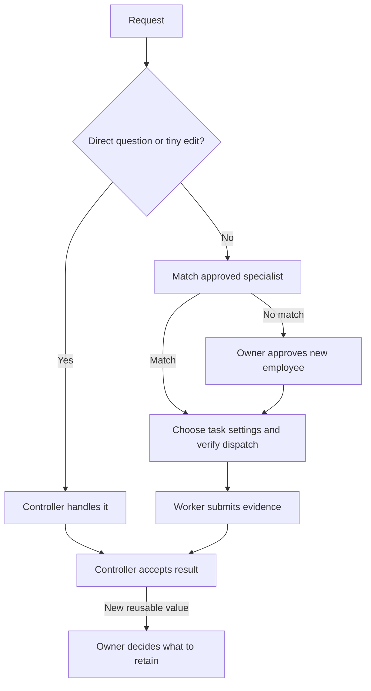

<h1 align="center">Open Jarvis</h1>

<p align="center">Specialist collaboration. Your settings. Reusable results.</p>

<p align="center">
  <a href="README.md">English</a> · <a href="README.zh-CN.md">简体中文</a> · <a href="README.ja.md">日本語</a>
</p>

<p align="center">
  <a href="LICENSE"></a>
  <a href="docs/compatibility.md"></a>
  <a href="https://github.com/lbtlm/open-jarvis/actions/workflows/release.yml"></a>
  <a href="https://github.com/lbtlm/open-jarvis/releases"></a>
</p>

Open Jarvis brings a controller-supervised workflow to **Codex Desktop and CLI**. Use it for development, writing, office work and video tasks: define acceptance, choose capable specialists, verify their execution and keep useful results with your approval.

[Quick start](#quick-start) · [Capabilities](#capabilities) · [Workflow](#workflow) · [Employees & settings](#employees-and-settings) · [Commands](#commands) · [Reusable assets](#assets) · [FAQ](#faq) · [Verification](#verification) · [Contributing](#contributing)

<a id="quick-start"></a>

## Quick start

Requires **Node.js 22+** (npm/npx included) and a signed-in Codex client with standalone subagent role configuration. Desktop and CLI share one installation when they use the same Codex home.

Choose a published version from [GitHub Releases](https://github.com/lbtlm/open-jarvis/releases). The commands below use **0.1.0**; update the version, URL and filename together. If that artifact is unavailable, use a reviewed local tarball as shown below.

```sh
npx --package=https://github.com/lbtlm/open-jarvis/releases/download/v0.1.0/open-jarvis-0.1.0.tgz open-jarvis install
```

**Choose your setup in the terminal wizard:** controller and worker models, reasoning effort, Fast, and an employee starter. The starter defaults to `none`, so you can begin with the collaboration rules and add specialists as needed. Existing preferences take priority; fresh installs recommend Astra / High for the controller. Fast is separate and defaults to off. Ultra and a switch to Sol are never enabled automatically.

<details>
<summary>pnpm alternative and reviewed local packages</summary>

```sh
pnpm --package=https://github.com/lbtlm/open-jarvis/releases/download/v0.1.0/open-jarvis-0.1.0.tgz dlx open-jarvis install
```

For a reviewed tarball in your current directory, use either runner:

```sh
npx --package ./open-jarvis-0.1.0.tgz open-jarvis install
pnpm --package=./open-jarvis-0.1.0.tgz dlx open-jarvis install
```

Both runners use the same Codex home, employees and assets. The package is distributed through GitHub Releases, **not the npm registry**; dependencies may still come from npm, so installation is not necessarily offline. Installation targets `--home`, then `CODEX_HOME`, then `~/.codex`. `--yes` is noninteractive and preserves existing preferences. pnpm **10.18.1** has been tested locally on Windows; see [compatibility (English)](docs/compatibility.md).

</details>

After installation, open a new Codex task and try:

> Complete this task using Jarvis. Have the controller define acceptance, select specialists by capability, supervise execution and accept the result. Record actual agent IDs and evidence of runtime settings.

Use `audit` to preview installation changes and `doctor` for static checks. A new session helps load configuration; an actual dispatch must still verify roles and runtime settings.

<a id="capabilities"></a>

## Capabilities

- **Work across domains.** Match specialists to the deliverable, language, methods and tools needed for development, writing, office or video work.
- **Make dispatch reviewable.** Keep scope, acceptance, requested settings, real agent IDs and runtime evidence visible.
- **Keep skills task-specific.** Use appropriate methods without permanently tying a profession to a model or skill list.
- **Reuse with approval.** Retain validated employee experience, skills, knowledge, preferences and templates; preview migration before applying it.

<a id="workflow"></a>

## Workflow



### Four separate choices

- **Employee:** a reusable professional card describing capability, scope and evidence. It is not a resident service or native-role registration.
- **Skill:** the method for this task. Explicit user requests come first, then suitable installed skills; missing methods may require an external search and separate installation approval.
- **Execution settings:** model, effort and Fast selected for the assignment, with actual runtime verification. Employee identity does not permanently lock them.
- **Retained assets:** validated results saved for later use only with owner approval. Task approval is not permanent-retention approval; there is no background automatic training.

<a id="employees-and-settings"></a>

## Employees and execution settings

The controller handles ordinary questions, single-step lookups and tiny, directly verifiable edits.
For other work, it first checks the required domain, deliverable, language, methods and tools, then prefers reuse among approved specialists whose capabilities match.
Approval, availability and a fixed model do not establish professional competence.
If no specialist matches, the controller proposes a temporary employee with responsibilities, skills and settings, then dispatches after user approval.
It does not force an unrelated employee into the task or rename one to imply expertise.

| Execution profile | Recommended model / effort | Suitable work |
| --- | --- | --- |
| `controller` | GPT-6 Astra / High | Coordination, supervision and final acceptance |
| `luna` | GPT-6 Luna / Medium | Clear, small tasks with low risk |
| `simple` | GPT-6.1 Sol / Low | Simple implementations with known mechanisms |
| `terra` | GPT-6.1 Sol / Medium | Routine tasks and scoped investigation of unknown failures |
| `sol` | GPT-6.1 Sol / High | Contract changes, complex semantics or critical behavior |
| `reviewer` | GPT-6.1 Sol / High | Independent review triggered by risk or evidence |

These are recommendations; existing user choices take priority. `terra` is a compatibility key, not a GPT-6 Terra product.
Fast is selected separately from model and effort. Model access, permissions and service settings require runtime verification.
The default is one executor. At most three subagents run concurrently, including Reviewer and excluding the controller, subject to lower user or global limits.
Executors do not delegate recursively. Independent review is triggered by specified risks or evidence, rather than required for every task.
If necessary model, Fast or Reviewer read-only settings cannot be preserved, report that dispatch as blocked.

<details>
<summary>Starter cards and skill planning</summary>

| Starter | Candidate employees |
| --- | --- |
| `none` | No employee cards added |
| `development` | Iris (frontend), Atlas (backend), Quinn (QA), Sentry (review) |
| `writing` | Nova (writing) |
| `office` | Clara (office work) |
| `video` | Frame (video) |

Starters provide candidate cards; they do not mean employees are hired, skills are loaded or experience is verified.
The older `employees --init --yes` command remains compatible and defaults to adding missing development cards.
For example, preview writing candidates before explicitly writing them:

```sh
npx --package ./open-jarvis-0.1.0.tgz open-jarvis employees --init --starter writing
npx --package ./open-jarvis-0.1.0.tgz open-jarvis employees --init --starter writing --yes
npx --package ./open-jarvis-0.1.0.tgz open-jarvis plan --employee nova-writer --difficulty standard --skill my-writing-skill
```

`my-writing-skill` is a placeholder skill ID. Replace it with an existing skill; a missing skill blocks the plan.
`plan` does not dispatch employees, read skill bodies or prove that skills have loaded.
Follow explicitly requested skills first, then look for suitable installed skills; search externally only when something is still missing.
A card's suggestions are not a whitelist. `--skill` can temporarily bind a skill outside the card without permanently editing it.
Installing Jarvis does not install a whole skill catalog or provide Office, editing, plugin or cloud-account capabilities.
An employee card is a file asset, not a resident process. See [employee conventions (English)](payload/skills/jarvis-orchestrator/references/employees.md).

</details>

<a id="commands"></a>

## Common commands

The entries below are **command suffixes**, not standalone shell commands. Append one to the full runner prefix:

```sh
npx --package=https://github.com/lbtlm/open-jarvis/releases/download/v0.1.0/open-jarvis-0.1.0.tgz open-jarvis
```

For every suffix, you can instead use `pnpm --package=https://github.com/lbtlm/open-jarvis/releases/download/v0.1.0/open-jarvis-0.1.0.tgz dlx open-jarvis` as the prefix. With a reviewed local package, use `npx --package ./open-jarvis-0.1.0.tgz open-jarvis` or `pnpm --package=./open-jarvis-0.1.0.tgz dlx open-jarvis` and keep the suffix unchanged.

| Command suffix | Purpose |
| --- | --- |
| `audit` | Preview installation changes without writing |
| `install --starter none` | Install or upgrade with protected backups |
| `doctor` | Statically inspect installed files |
| `rollback --manifest /path/to/manifest.json` | Restore one installation using its manifest |
| `employees --query writing` | Search employee cards or preview starter initialization |
| `plan --employee nova-writer --difficulty standard` | Preview an employee, skills and execution profile |
| `export --out ./my-assets.jarvis.json.gz` | Write a new asset archive |
| `import --from ./my-assets.jarvis.json.gz` | Preview an archive before applying it |

For example, run the static check with:

```sh
npx --package=https://github.com/lbtlm/open-jarvis/releases/download/v0.1.0/open-jarvis-0.1.0.tgz open-jarvis doctor
```

`/path/to/manifest.json` is a placeholder; replace it with the actual installation manifest.
`--home PATH` selects the Codex home; `--project PATH` explicitly selects project assets; `--json` returns machine-readable output.
Use `npx --package ./open-jarvis-0.1.0.tgz open-jarvis --help` for all options.
`audit` and `doctor` make no live model requests and do not prove an employee has run.

<a id="assets"></a>

## Reusable assets

Reusable results follow a small loop: propose a candidate → validate → let the user decide → save or update → reuse later.
Employee experience, skills, knowledge, preferences and templates can be retained; experience requires evidence and applicable conditions.
Approval for a task or temporary hire is not approval for permanent retention. This does not train models or automatically rewrite long-term instructions.
Scores, retrospectives and statistics are not compulsory after every task. See [asset evolution (Chinese)](docs/asset-evolution.md).

<details>
<summary>Migration commands, paths and limits</summary>

Personal assets live under `jarvis/` in the Codex home; project assets live under `.jarvis/`.
Export includes employees, knowledge, preferences, resources, selected skill directories and model preferences.
`jarvis/skills.json` explicitly registers supporting skill dependencies; export does not scan every skill or plugin or infer all dependencies from prose.
Default skill roots are project `.agents/skills`, project `.codex/skills`, home `skills`, then sibling `.agents/skills` beside the home.
Repeated `--skill-root PATH` options completely replace the default export-root list.

```sh
npx --package ./open-jarvis-0.1.0.tgz open-jarvis export --out ./my-assets.jarvis.json.gz
npx --package ./open-jarvis-0.1.0.tgz open-jarvis import --from ./my-assets.jarvis.json.gz
npx --package ./open-jarvis-0.1.0.tgz open-jarvis import --from ./my-assets.jarvis.json.gz --yes
npx --package ./open-jarvis-0.1.0.tgz open-jarvis install --models /path/to/codex-home/jarvis/models.json --yes
```

For project assets, explicitly pass `--project` on both source export and destination import, using each machine's project path.
Import previews first; `--yes` writes. Identical content is skipped; any differing content stops the entire batch without overwriting or running scripts.
Replace the path in the last command. Review model preferences before explicitly activating them through installation; import alone does not change the controller.
Restore sign-in, plugins, external tools and permissions separately on the destination. Absolute paths inside assets are not rewritten.
Archive limits: **4 MiB** per file, **32 MiB** total content, **16 MiB** compressed and **5000** files.
Move large media such as video separately. Export does not redact file contents; review before sharing. Hashes check integrity, not source authenticity.
See [asset procedures (English)](payload/skills/jarvis-orchestrator/references/assets.md).

</details>

<a id="faq"></a>

## FAQ

**Will it replace my controller?** Existing model, effort and Fast preferences are preserved; a fresh installation recommends Astra / High.
Review a file before explicitly applying `--models`. Professions and execution profiles do not automatically replace the user's controller.

**How do I verify it is active?** Run `audit` / `doctor`, then open a new task and perform an actual dispatch.
Record real agent IDs and runtime settings. A configuration file or new session does not guarantee native registration, hot reload or effective permissions.

**What if no employee fits?** Propose a temporary profession matching the domain, language, deliverable and tools, then execute after approval.
Templates and job titles are not competence evidence. An unrelated backend employee should not be renamed as a language specialist.

**How do updates and rollback work?** Run `audit`, then `install`; use the installation manifest path with `rollback --manifest`.
Installation and rollback manage their own configuration without deleting user employees or assets. Later conflicting edits cause rollback to refuse. Backups may be sensitive; keep them private.

<a id="verification"></a>

## Verification and current limits

[CI run 36688019909](https://github.com/lbtlm/open-jarvis/actions/runs/36688019909) passed every Windows/macOS/Linux × Node 22/24 job, both package runners and CI Gate. The final suite contained **91 tests**: Windows **90 passed / 1 POSIX-only skipped**; macOS and Linux **91 passed**.

A **limited review of release code** passed. The older independent review of `assets.mjs` remains incomplete; this is not a full security audit. The linked CI run does not verify a two-real-version upgrade or installation from a public Release. Check the [Release workflow](https://github.com/lbtlm/open-jarvis/actions/workflows/release.yml) for publication and public-URL installation results. Static checks do not prove live model capabilities.

These three full READMEs describe the same features. The CLI and detailed reference documents remain mostly untranslated; linked documents are labeled by language. See [validation (English)](docs/validation.md) and [release procedures (English)](docs/releasing.md).

<a id="contributing"></a>

## Contributing and releases

Develop features on branches and merge them into `dev` through PRs. For a release, open a `dev` → `main` release PR.
Merging into `main` authorizes automatic CI/CD: once workflow checks pass, it creates the version tag and GitHub Release package without a second publication approval.
A failed workflow may leave a public Release awaiting installation verification. Check the run summary and Release artifacts separately.
GitHub Releases host the package, but installation dependencies may still come from a registry; fully offline installation is not guaranteed.
See [release procedures (English)](docs/releasing.md) and [upgrades (English)](docs/upgrading.md) for version selection, updating and rollback.

<details>
<summary>Contributor checks</summary>

Maintainers use npm and `package-lock.json`; no pnpm lockfile is added. Relevant development checks are:

```sh
npm ci --ignore-scripts
npm run check
npm test
npm run test:package
pnpm run test:package:pnpm
```

</details>

Read [CONTRIBUTING (English)](CONTRIBUTING.md) and [SECURITY (English)](SECURITY.md). The license is [MIT](LICENSE).

[English](README.md) · [简体中文](README.zh-CN.md) · [日本語](README.ja.md)
