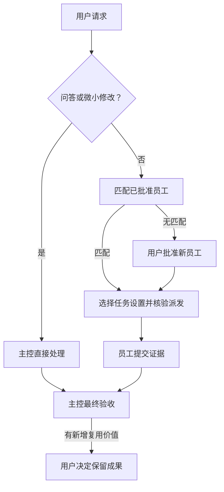

<h1 align="center">Open Jarvis</h1>

<p align="center">专业员工协作，尊重你的设置，复用有价值的成果。</p>

<p align="center">
  <a href="README.md">English</a> · <a href="README.zh-CN.md">简体中文</a> · <a href="README.ja.md">日本語</a>
</p>

<p align="center">
  <a href="LICENSE"></a>
  <a href="docs/compatibility.md"></a>
  <a href="https://github.com/lbtlm/open-jarvis/actions/workflows/release.yml"></a>
  <a href="https://github.com/lbtlm/open-jarvis/releases"></a>
</p>

Open Jarvis 为 **Codex Desktop 和 CLI** 提供主控监督的协作流程。适用于开发、写作、办公和视频任务：定义验收、选择合适员工、核验执行，并经你批准保留可复用成果。

[快速开始](#quick-start) · [核心能力](#capabilities) · [工作流程](#workflow) · [员工与设置](#employees-and-settings) · [常用命令](#commands) · [可复用资产](#assets) · [常见问题](#faq) · [验证情况](#verification) · [贡献](#contributing)

<a id="quick-start"></a>

## 快速开始

需要 **Node.js 22+**（含 npm/npx）及已登录、支持独立子代理角色配置的 Codex。Desktop 和 CLI 共用 Codex home 时只需安装一次。

从 [GitHub Releases](https://github.com/lbtlm/open-jarvis/releases) 选择已发布版本。以下命令以 **0.1.0** 为例，请同步替换版本、URL 和文件名。如果对应产物不可用，请使用下方经过审阅的本地安装包。

```sh
npx --package=https://github.com/lbtlm/open-jarvis/releases/download/v0.1.0/open-jarvis-0.1.0.tgz open-jarvis install
```

**在终端向导中选择配置：** 主控和执行角色的模型、思考强度、Fast，以及员工模板。模板默认为 `none`，可先安装协作规则，再按需添加员工。已有偏好优先；全新安装的主控推荐 Astra / High。Fast 单独选择，默认关闭，不会自动开启 Ultra 或切换到 Sol。

<details>
<summary>pnpm 等价入口与经过审阅的本地安装包</summary>

```sh
pnpm --package=https://github.com/lbtlm/open-jarvis/releases/download/v0.1.0/open-jarvis-0.1.0.tgz dlx open-jarvis install
```

将审阅过的安装包放在当前目录后，任选一个入口：

```sh
npx --package ./open-jarvis-0.1.0.tgz open-jarvis install
pnpm --package=./open-jarvis-0.1.0.tgz dlx open-jarvis install
```

两种入口共用 Codex home、员工和资产。包通过 GitHub Releases 分发，**未发布到 npm registry**；依赖仍可能从 npm 获取，不保证完全离线。安装目标依次取 `--home`、`CODEX_HOME`、`~/.codex`。`--yes` 非交互安装并保留已有偏好。pnpm **10.18.1** 已在 Windows 本地验证，详见[兼容性说明（英文）](docs/compatibility.md)。

</details>

安装后打开新的 Codex 任务，例如：

> 按 Jarvis 流程完成这个任务。主控定义验收，按能力选择员工，监督执行并最终验收；记录真实代理 ID 和运行时设置证据。

安装前用 `audit` 预览变更，安装后用 `doctor` 静态检查。新会话有助于加载配置；角色和运行时设置仍需通过真实派发核验。

<a id="capabilities"></a>

## 核心能力

- **跨领域协作。** 根据开发、写作、办公或视频任务的交付物、语言、方法与工具选择专业员工。
- **派发可核验。** 明确范围、验收、请求设置、真实代理 ID 和运行时证据。
- **按任务选择技能。** 使用合适方法，不把专业身份永久绑定到模型或技能清单。
- **经批准复用成果。** 保留经过验证的员工经验、技能、知识、偏好和模板；迁移先预览再写入。

<a id="workflow"></a>

## 工作流程



### 分开管理四类选择

- **员工：** 描述专业能力、范围与证据的可复用岗位卡，不是常驻服务或原生角色注册。
- **技能：** 本次任务的方法。优先遵循用户指定，再找已安装的匹配技能；仍有缺口时可搜索外部技能，安装需另行批准。
- **执行设置：** 本次任务选择的模型、思考强度与 Fast，需要真实运行时核验；员工身份不永久锁定设置。
- **保留资产：** 经验证并由用户批准保存的可复用成果。任务批准不等于永久保存批准，不会后台自动训练。

<a id="employees-and-settings"></a>

## 员工与执行设置

普通问答、单步查询和微小可验证修改由主控直接处理。
其他任务先判断所需领域、交付物、语言以及方法和工具，再在能力匹配的已批准员工中优先复用。
批准状态、空闲状态或固定模型都不能证明专业能力。
缺少匹配岗位时，主控提出临时新员工，说明职责、技能与设置，获用户批准后派发。
不会强行复用无关员工，也不会通过改名宣称已有能力。

| 执行档位 | 推荐模型 / 思考强度 | 适用任务 |
| --- | --- | --- |
| `controller`（主控） | GPT-6 Astra / High | 调度、监督与最终验收 |
| `luna` | GPT-6 Luna / Medium | 明确且低风险的小任务 |
| `simple` | GPT-6.1 Sol / Low | 已知机制的简单实现 |
| `terra` | GPT-6.1 Sol / Medium | 常规任务及范围内未知故障探索 |
| `sol` | GPT-6.1 Sol / High | 契约变化、复杂语义或关键行为 |
| `reviewer` | GPT-6.1 Sol / High | 风险或证据触发的独立复核 |

这些是推荐设置，已有用户选择优先。`terra` 是兼容键，不代表 GPT-6 Terra 产品。
Fast 与模型和思考强度分开选择；可用模型、权限和服务设置需在实际运行时核验。
默认一个执行者；同时运行的子代理最多三个，包含 Reviewer、不含主控，并服从更低的用户或全局限额。
执行者不递归委派。独立复核由明确风险或证据触发，并非每个任务都安排。
无法保留必要模型、Fast 或 Reviewer 只读权限时，应报告该派发阻塞。

<details>
<summary>员工模板与技能计划</summary>

| 模板 | 候选员工 |
| --- | --- |
| `none` | 不添加员工卡 |
| `development` | Iris（前端）、Atlas（后端）、Quinn（QA）、Sentry（复核） |
| `writing` | Nova（写作） |
| `office` | Clara（办公） |
| `video` | Frame（视频） |

模板只是候选卡，不等于已雇佣、已加载技能或有经验证明。
旧命令 `employees --init --yes` 仍兼容，默认添加缺失的开发模板卡。
例如，预览写作候选卡后再明确写入：

```sh
npx --package ./open-jarvis-0.1.0.tgz open-jarvis employees --init --starter writing
npx --package ./open-jarvis-0.1.0.tgz open-jarvis employees --init --starter writing --yes
npx --package ./open-jarvis-0.1.0.tgz open-jarvis plan --employee nova-writer --difficulty standard --skill my-writing-skill
```

`my-writing-skill` 是占位技能 ID，必须换为实际存在的技能；缺失时计划会报告阻塞。
`plan` 不派发员工、不读取技能正文，也不能证明技能已加载。
技能选择先遵循用户显式指定，再找已安装的匹配技能，仍缺少时才按需搜索外部技能。
员工卡的技能建议不是白名单；`--skill` 可临时绑定卡外技能，不会永久改卡。
安装 Jarvis 不会全库安装技能，也不会赋予 Office、剪辑、插件或云账号能力。
员工卡是文件资产，不是常驻进程。详见[员工约定（英文）](payload/skills/jarvis-orchestrator/references/employees.md)。

</details>

<a id="commands"></a>

## 常用命令

下表是**命令后缀**，不能单独作为 shell 命令运行。请把其中一项接在完整入口后：

```sh
npx --package=https://github.com/lbtlm/open-jarvis/releases/download/v0.1.0/open-jarvis-0.1.0.tgz open-jarvis
```

所有后缀也可接在 `pnpm --package=https://github.com/lbtlm/open-jarvis/releases/download/v0.1.0/open-jarvis-0.1.0.tgz dlx open-jarvis` 后。使用经过审阅的本地包时，入口改为 `npx --package ./open-jarvis-0.1.0.tgz open-jarvis` 或 `pnpm --package=./open-jarvis-0.1.0.tgz dlx open-jarvis`，后缀保持不变。

| 命令后缀 | 用途 |
| --- | --- |
| `audit` | 只读预览安装变更 |
| `install --starter none` | 安装或升级，并保护备份 |
| `doctor` | 静态检查已安装文件 |
| `rollback --manifest /path/to/manifest.json` | 按清单恢复一次安装 |
| `employees --query writing` | 检索员工卡或预览模板初始化 |
| `plan --employee nova-writer --difficulty standard` | 预览员工、技能及执行档位 |
| `export --out ./my-assets.jarvis.json.gz` | 写入新的资产归档 |
| `import --from ./my-assets.jarvis.json.gz` | 预览资产归档，确认后导入 |

例如，执行静态检查：

```sh
npx --package=https://github.com/lbtlm/open-jarvis/releases/download/v0.1.0/open-jarvis-0.1.0.tgz open-jarvis doctor
```

`/path/to/manifest.json` 是占位路径，请换成实际安装清单。
`--home PATH` 选择 Codex home；`--project PATH` 显式选择项目资产；`--json` 输出机器可读结果。
完整参数可通过 `npx --package ./open-jarvis-0.1.0.tgz open-jarvis --help` 查看。
`audit` 和 `doctor` 不发起实时模型请求，也不证明员工已运行。

<a id="assets"></a>

## 可复用资产

可复用成果按“形成候选 → 验证 → 用户决定 → 保存或更新 → 后续复用”积累。
可以保留员工经验、技能、知识、偏好和模板素材；经验须有实际证据和适用条件。
任务批准或临时雇佣不等于永久保存批准；不会自动训练模型或改写长期指令。
无需每次强制评分、复盘或统计。详见[资产自进化（中文）](docs/asset-evolution.md)。

<details>
<summary>迁移命令、路径与限额</summary>

个人资产位于 Codex home 的 `jarvis/`，项目资产位于 `.jarvis/`。
导出包括员工、知识、偏好、resources、选中技能目录和模型偏好。
`jarvis/skills.json` 显式登记支持技能依赖；不会自动扫描所有技能、插件或解析全部正文依赖。
默认技能根目录依次是项目 `.agents/skills`、项目 `.codex/skills`、home `skills`、home 同级 `.agents/skills`。
重复的 `--skill-root PATH` 完整替换默认导出根目录列表。

```sh
npx --package ./open-jarvis-0.1.0.tgz open-jarvis export --out ./my-assets.jarvis.json.gz
npx --package ./open-jarvis-0.1.0.tgz open-jarvis import --from ./my-assets.jarvis.json.gz
npx --package ./open-jarvis-0.1.0.tgz open-jarvis import --from ./my-assets.jarvis.json.gz --yes
npx --package ./open-jarvis-0.1.0.tgz open-jarvis install --models /path/to/codex-home/jarvis/models.json --yes
```

有项目资产时，源机器的导出和目标机器的导入都需显式添加 `--project`，使用各自项目路径。
导入先预览，`--yes` 才写入；相同内容跳过，任何内容差异使整批停止，不覆盖或执行脚本。
最后一条命令中的路径需替换；先审阅模型偏好，再明确安装激活，导入本身不会改变主控。
目标机器的登录、插件、外部工具与权限须另行恢复；资产中的绝对路径不会自动重写。
归档限额：单文件 **4 MiB**、总内容 **32 MiB**、压缩包 **16 MiB**、最多 **5000** 个文件。
视频等大媒体另行迁移。导出不自动脱敏正文，分享前请审阅；hash 校验是完整性检查，不是来源签名。
详见[资产执行约定（英文）](payload/skills/jarvis-orchestrator/references/assets.md)。

</details>

<a id="faq"></a>

## 常见问题

**会改掉我的主控吗？** 已有模型、思考强度和 Fast 偏好会保留；新安装推荐 Astra / High。
显式使用 `--models` 前先审阅文件。专业岗位与模型档位不会自动替换用户主控。

**怎样确认安装生效？** 先运行 `audit` / `doctor`，再打开新任务并实际派发。
记录真实代理 ID 和运行时设置；配置文件存在或新会话开始都不保证原生角色注册、热加载或权限生效。

**没有适合的员工怎么办？** 提出符合领域、语言、交付物和工具需求的临时岗位，获批准后执行。
模板和岗位名不能代替能力证据；不把无关后端员工改名为语言专家。

**如何更新和回滚？** 先 `audit`，再 `install`；回滚使用该次安装清单的 `--manifest` 路径。
安装和回滚只管理自身配置，不删除用户员工或资产；后续修改冲突会拒绝回滚。备份可能敏感，请勿公开。

<a id="verification"></a>

## 验证情况与当前限制

[CI 运行 36688019909](https://github.com/lbtlm/open-jarvis/actions/runs/36688019909) 已通过全部 Windows/macOS/Linux × Node 22/24 矩阵任务、两种包入口和 CI Gate。最终测试集共 **91 项**：Windows **90 通过 / 1 项仅限 POSIX 的测试跳过**；macOS 和 Linux **91 通过**。

**发行代码的有限范围复核**已通过。较早的 `assets.mjs` 独立复核仍未完成，不代表完整安全审计。所链接的 CI 未验证两个真实版本之间的升级或公开 Release 的安装；发布及公开地址安装结果请查看 [Release 工作流](https://github.com/lbtlm/open-jarvis/actions/workflows/release.yml)。静态检查不证明实时模型能力。

三份完整 README 介绍同一套功能。CLI 和详细参考文档大多尚未翻译，链接已标明目标语言。详见[验证记录（英文）](docs/validation.md)和[发布流程（英文）](docs/releasing.md)。

<a id="contributing"></a>

## 贡献与发布

功能开发使用分支，通过 PR 合入 `dev`；准备发行时，再创建 `dev` → `main` 的发布 PR。
合并到 `main` 即批准自动 CI/CD：通过工作流检查后生成版本标签和 GitHub Release 安装包，无需二次发布审批。
工作流失败时，可能已有公开 Release 等待安装验证；请分别核对运行摘要与 Release 产物。
包由 GitHub Release 托管，但安装依赖仍可能从 registry 获取，不保证完全离线。
发行规则见[发布流程（英文）](docs/releasing.md)，版本选择、更新与回滚见[升级说明（英文）](docs/upgrading.md)。

<details>
<summary>贡献者检查</summary>

维护者使用 npm 和 `package-lock.json`，不新增 pnpm 锁文件。相关开发检查为：

```sh
npm ci --ignore-scripts
npm run check
npm test
npm run test:package
pnpm run test:package:pnpm
```

</details>

贡献请阅读 [CONTRIBUTING（英文）](CONTRIBUTING.md)，安全问题见 [SECURITY（英文）](SECURITY.md)；许可为 [MIT](LICENSE)。

[English](README.md) · [简体中文](README.zh-CN.md) · [日本語](README.ja.md)
