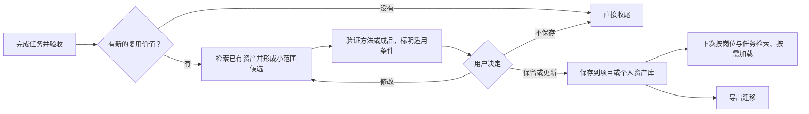

# 用户资产自进化

Jarvis 的“成长”是积累可复用资产，不是自动训练模型。主控仍负责派发和验收，员工的岗位、技能组合、经验及素材可以长期保留；每次任务的模型、思考深度、Fast 单独选择。



候选必须先展示具体内容或差异、证据与保存位置。获准范围内的更新无需重复询问；批准做任务或雇佣员工，不等于批准自动改写长期资产。草稿放在当前任务输出目录，确认后才进入资产库。更新既有资产前用 Git 历史或库外备份保留旧版。不强制每次复盘、评分、统计或新增技能。

| 要沉淀的内容 | 保存方式 | 例子 |
| --- | --- | --- |
| 专业职责、技能组合、能力证据和限制 | 员工卡 `jarvis/employees/*.md` | 写作员工的职责与已验证能力；链接到经验原文 |
| 经批准的可复用经验 | `jarvis/knowledge/experience/*.md` | 实际验证过的方法、适用条件、反例与证据 |
| 可重复执行的方法 | 标准 Agent Skill | 用户自己的月报整理流程，配套脚本与模板 |
| 项目/领域事实 | `jarvis/knowledge/*.md` | 小说设定、术语表、报表口径与来源 |
| 用户稳定偏好 | `jarvis/preferences.md` | 用户确认的文风、呈现方式和协作习惯 |
| 文档模板、分镜、样例、素材 | `jarvis/resources/` | 月报模板、品牌素材、字幕样例 |

上表个人路径位于 `CODEX_HOME`；项目资产对应 `.jarvis/`。项目事实和私有资料优先留在项目。技能自带的小模板放在该技能的 `assets/`，不用重复复制。资源可附简短说明，记录用途、适用条件、来源和授权信息。经验只记录实际验证结果，不凭岗位名宣称能力。普通资源文件不作为系统指令自动加载。

员工检索先看名字、专业和关键词，只读命中卡；技能先遵循用户明确指定，再找已安装的匹配能力，缺少才按需搜索。卡内技能只是常用建议，临时绑定新技能不会永久修改员工卡。长期沉淀时优先更新同类资产，避免重复堆积。失效内容需提出修正或归档建议，由用户决定。

## Markdown 经验（开发中，尚未发布）

候选保存在任务输出目录，位于受管理的资产导出根目录之外；元数据写着 `draft` 不能保证排除导出。先展示具体候选、证据、目标范围与内容 hash，经明确批准后才保存到个人 `CODEX_HOME/jarvis/knowledge/experience/` 或项目 `.jarvis/knowledge/experience/`。模板只提供结构，不验证事实；贡献者只记录实际完成的工作，不追认他人的验收或发布结果。

经验原文是唯一权威记录，员工卡只链接它。后续按任务和能力检索，员工身份仅作为线索；内置 CLI 直接读取文件，对元数据与正文作 Unicode 子串匹配，不创建索引数据库。用户可另行安装 QMD，在 `CODEX_HOME/jarvis-state/qmd.json` 登记本机入口及获准集合；主控据此检索员工、技能和经验，关键词不足时按需使用已验证的语义模型，命中后仍回读原文。QMD 不可用时回退本地查询，不改变资产位置、不要求 CUDA，也不自动安装扩展或重排模型。模型、索引和本机设置不随资产导出，换电脑后按需重建；具体见 [QMD 可选接入](experience.md#optional-qmd-setup)。

派发前重新读取适用且有效的记录，在任务合同中带上 ID、范围、相对路径、标题和当前内容 hash，并说明适用理由。CLI `plan` 只产生计划，不启动员工或证明技能已加载；编排技能指导主控检索与真实派发，不是运行时强制机制。经验正文按参考证据处理，不作为更高优先级指令。

获准经验复用现有导出/导入，不增加第二种归档、云同步或自动学习服务。修正与停用也需按获准范围处理，旧版由 Git 或库外备份保留。详细参数、更新冲突和本地 feature 包示例见 [Markdown experience（英文）](experience.md)。已发布 0.1.3 包尚不含此开发功能，下方原有安装与迁移示例仍针对 0.1.3。

## 安装与复用

首次安装可以不选模板，也可选开发、写作、办公或视频。模板是候选卡，不是已经雇佣的员工，也不会安装第三方技能。从 GitHub Release 下载所选版本的安装包后，通过 npx 使用；下面以当前目录中的 `open-jarvis-0.1.3.tgz` 为例：

```sh
npx --package ./open-jarvis-0.1.3.tgz open-jarvis install --starter none
npx --package ./open-jarvis-0.1.3.tgz open-jarvis employees --init --starter writing --yes
npx --package ./open-jarvis-0.1.3.tgz open-jarvis employees --query 小说
npx --package ./open-jarvis-0.1.3.tgz open-jarvis plan --employee nova-writer --difficulty standard --skill my-writing-skill
```

首次 Release 发布前使用已验收的本地安装包。发布后也可将 `--package` 的值换成该版本的 GitHub Release 下载 URL，参数不变，无需手动运行 Node 脚本。详见[安装入口](compatibility.md)。

也支持 pnpm：将示例中的 npx 命令前缀换成 `pnpm --package=./open-jarvis-0.1.3.tgz dlx open-jarvis`。员工查询、计划、导出、导入及激活的参数和保存位置完全相同，无需建立另一套资产库。

最后一条要求技能实际存在，否则预览会报告阻塞；`plan` 不启动员工、不证明技能已加载。写作、办公、视频的实际工具由当前环境提供，安装 Jarvis 不意味着拥有剪辑、渲染、Office 或云账号能力。

## 一次导出、另一台电脑恢复

```sh
npx --package ./open-jarvis-0.1.3.tgz open-jarvis export --out ./my-assets.jarvis.json.gz
# 有项目资产时，导出和导入均显式添加 --project 项目绝对路径
npx --package ./open-jarvis-0.1.3.tgz open-jarvis import --from ./my-assets.jarvis.json.gz
npx --package ./open-jarvis-0.1.3.tgz open-jarvis import --from ./my-assets.jarvis.json.gz --yes
# 审阅迁移的模型偏好后再显式激活
npx --package ./open-jarvis-0.1.3.tgz open-jarvis install --models /path/to/codex-home/jarvis/models.json --yes
```

包含员工、知识、偏好、资源、选中技能及可迁移模型偏好。技能由员工卡、`jarvis/skills.json` 和已安装编排技能确定；支持技能依赖需显式登记，不自动解析技能正文的全部依赖。插件、账号、外部工具和素材引用目标需要另行恢复，绝对路径不自动重写。导入默认只预览；同内容跳过，有差异整批停止，不覆盖、不执行脚本。

归档上限为单文件 4 MiB、总文件内容 32 MiB、压缩包 16 MiB、5000 个文件。大视频等原始媒体请单独迁移，并在资源目录保留说明或引用。导出过滤敏感路径，但不扫描并脱敏正文；用户应检查资源内容后再分享。包是私人资产备份，不应自动发布到开源仓库；仓库忽略 `*.jarvis.json.gz`，公共 npm 包只携带通用模板。

执行细则维护在 [assets.md](../payload/skills/jarvis-orchestrator/references/assets.md)。它是工作约定和文件资产流程，目前没有自动学习服务、跨机器同步守护或运行时强制拦截器。
